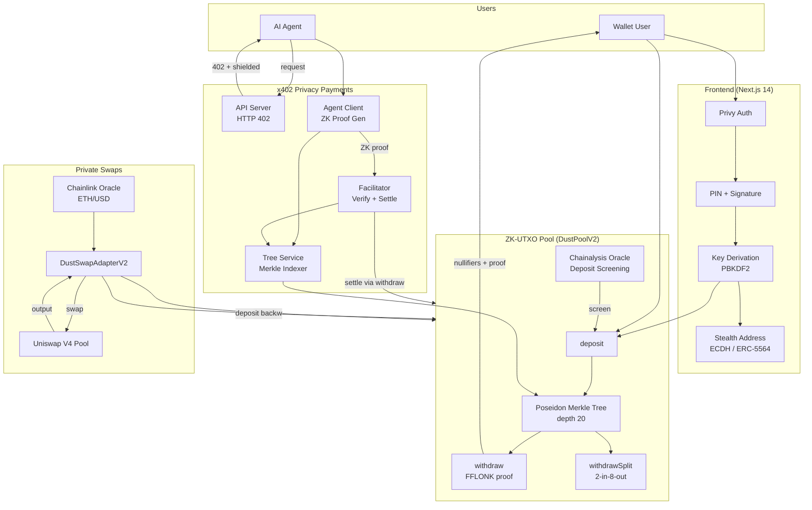
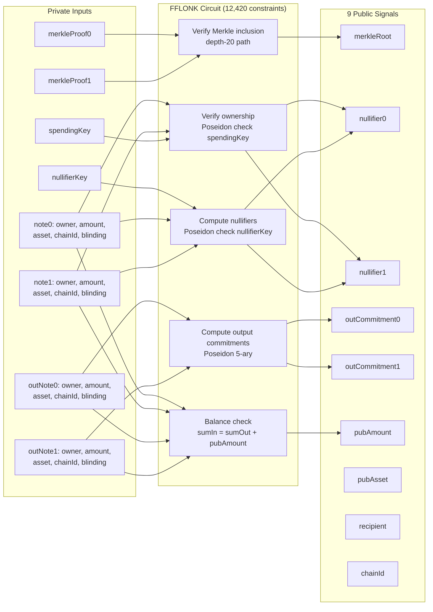
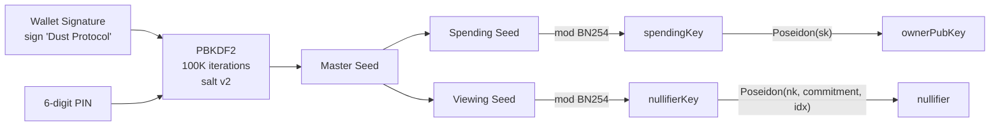
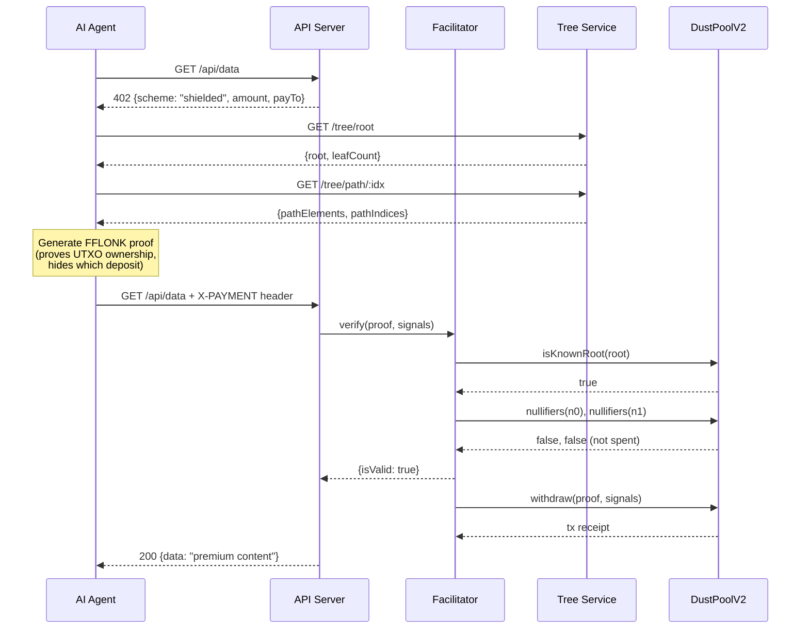
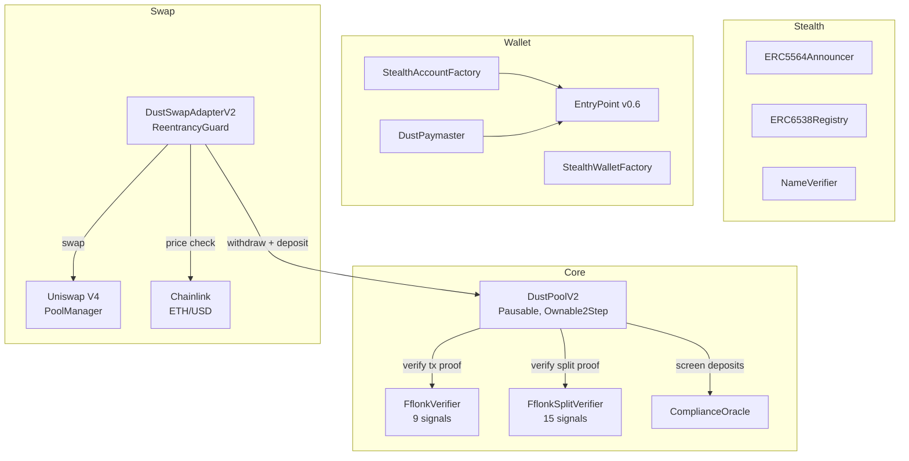

# Dust Protocol — Architecture

## System Overview

## ZK Circuit: 2-in-2-out Transaction

## Key Derivation

## Privacy Guarantees

| Property | Hidden | Public |
|----------|--------|--------|
| **Deposit amount** | After mixing | At deposit time |
| **Withdrawal source** | Which deposit funded it | That *some* valid UTXO was spent |
| **Sender identity** | Deposit-to-withdraw link | Nullifier (unlinkable to deposit) |
| **Recipient** | Stealth address (ECDH) | On-chain stealth address (one-time) |
| **Swap amounts** | Input/output split | Net pool delta |
| **UTXO balances** | Individual note values | Pool TVL |
| **x402 payer** | Agent identity + deposit link | Proof validity + payment amount |
| **Key material** | spendingKey, nullifierKey, PIN | ownerPubKey, nullifiers, commitments |

## Multi-Chain Deployment

| Contract | Eth Sepolia | Thanos Sepolia | Arbitrum Sepolia | OP Sepolia | Base Sepolia |
|----------|:-----------:|:--------------:|:----------------:|:----------:|:------------:|
| **DustPoolV2** | `0x3cbf..3f` | `0x130e..29` | `0x07E9..5d` | `0x068C..aB` | `0x17f5..16` |
| **FFLONK Verifier** | `0xd0f5..8a` | `0x3a8D..da` | `0x8359..28` | `0xe130..cA` | `0xe51e..52` |
| **Split Verifier** | `0x472C..20` | `0xbcb3..E7` | `0x7E72..3A` | `0x6546..06` | `0x503e..F7` |
| **DustSwapAdapterV2** | `0xb91A..00` | -- | `0xe1Ca..94` | -- | `0x844d..16` |
| **Stealth (5564/6538)** | yes | yes | yes | yes | yes |
| **ERC-4337 (Paymaster)** | yes | yes | yes | yes | yes |
| **Compliance Oracle** | yes | yes | yes | yes | yes |

## x402 Privacy Payment Flow

## Contract Architecture

